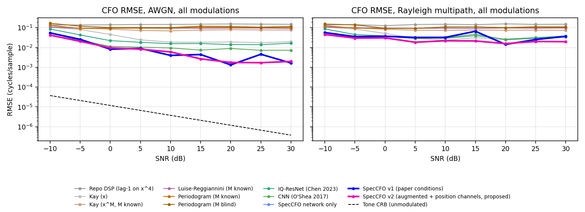
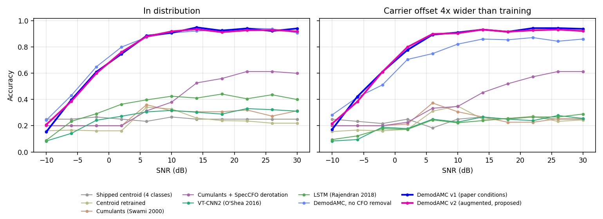

# DEmod learned models: carrier offset and modulation classification

This folder holds the research code behind two learned components of the local analysis API:

- **SpecCFO**, a carrier frequency offset (CFO) estimator.
- **DemodAMC**, a modulation classifier with calibrated confidence and abstention.

Both replace the first-generation baselines (the 7-12-3 TinyMLP for CFO and the feature-centroid classifier). The work recreates published models as baselines, trains and tests everything under one protocol, and reports where the new models win and where they do not.

> **Scope.** Everything here is trained and tested on simulated signals. No result is evidence of performance on real captures. Baselines were trained on a CPU for a few minutes each, not at the budgets in the papers, so "beats the recreation at this budget" is the strongest claim the tables support. I did not try to reproduce any paper's published numbers, only its architecture and experimental protocol.

Full tables and figures are in [`results/tables.md`](results/tables.md), `results/*.png` and the raw JSON next to them.

## 1. What was wrong with the first-generation models

| Component | Problem | Evidence |
| --- | --- | --- |
| TinyMLP carrier offset | It regressed absolute Hz from features that depend on the sample rate. It was trained at 1 MS/s with offsets within 2.5 kHz. | On a 250 kS/s capture with a true offset of 1500 Hz it returned about -595,000 Hz, far outside the possible range of +-125 kHz. |
| Lag-one x^4 DSP estimator | It wraps beyond +-1/8 cycles per sample and only works for QPSK-like signals. | Median error 0.067 cycles/sample on the 11-modulation sweep. |
| Feature-centroid classifier | Five hand-picked features, no FSK or analog classes, trained on the repo's own recipe signals. | An FSK capture was classified as QPSK. On pulse-shaped signals the 4-class accuracy is 25%, which is chance. |
| Recipe generator | `generate_synthetic.py` line 90 draws a new random symbol on every sample, so `samples_per_symbol` is ignored and the recipe signals are effectively one sample per symbol. | Lag-one autocorrelation of a "4 samples per symbol" signal is 0.008. Held symbols would give about 0.75. |

The generator was left unchanged so the shipped baselines stay comparable. `tests/test_recipe_generator_quirk.py` records the defect as an expected failure and will start passing when it is fixed. At that point the TinyMLP and centroid classifier should be retrained.

## 2. Papers recreated as baselines

Where a paper leaves a detail unstated, the choice made here is written in `jax_models.py` and listed below.

| Task | Model | Source | Assumed where unstated |
| --- | --- | --- | --- |
| CFO | IQ-ResNet: Conv16, three residual stages (16, 32/2, 64/2), FC, BN+ReLU, MSE | Chen, Zheng, Zhu, Xuan, Yang (2023), arXiv:2311.16155 | Kernel size 3 |
| CFO | Conv(32), AvgPool, Conv(128), Conv(256), Linear(1), MSE | O'Shea, Karra, Clancy (2017), arXiv:1707.06260 | Kernel 8, pool 4, strides 4 |
| CFO | Weighted phase averager | Kay (1989), IEEE TASSP | Applied to x and to x^M |
| CFO | Lag-sum autocorrelation | Luise and Reggiannini (1995), IEEE Trans. Commun. | 8 lags |
| CFO | x^M power periodogram with parabolic interpolation | Rife-Boorstyn style, as the "expert" baseline in O'Shea 2017 | Zero-pad 8x |
| AMC | VT-CNN2: Conv(256, 1x3), Conv(80, 2x3), Dense 256, dropout 0.5 | O'Shea, Corgan, Clancy (2016), EANN | 128-sample windows |
| AMC | Two LSTM layers of 128 over amplitude and phase | Rajendran et al. (2018), IEEE TCCN | 128-sample windows |
| AMC | Normalised fourth-order cumulants, minimum distance | Swami and Sadler (2000), IEEE Trans. Commun. | Run on the raw capture, and again after SpecCFO derotation so the baseline is not a strawman |

Window-based AMC baselines score each 1024-sample capture by averaging log-probabilities over its eight windows, so they see the same samples as the full-capture model.

## 3. Proposed models

### SpecCFO

1. **Physics-informed input.** Log power spectra of x^M for M in {1, 2, 4, 8}, all re-indexed onto one CFO axis so every channel votes for the same location. M-fold ambiguities show up as aliases the network can see.
2. **Fully convolutional circular network.** Circularly padded dilated residual convolutions over 512 CFO bins. A shifted offset shifts the input, so the network is translation-equivariant by construction. It outputs a probability over bins, so confidence comes for free and there is no regression to the mean.
3. **Classical refinement.** A zero-padded periodogram of x^M around the network's coarse bin, parabolic interpolation, and the strongest line wins. This recovers near-optimal precision at high SNR.
4. **Low-confidence fallback.** Below a tuned confidence the circular posterior mean replaces the peak. This is the MSE-optimal answer when the network is unsure. The threshold is chosen on a validation set that is disjoint from every test set.
5. **Units.** Everything is in cycles per sample and scaled to Hz only at the end. This removes the failure that broke the TinyMLP.

**v2** adds three things after a failure found on the repo's own signals (section 6):

- a wider training distribution: pulse shapes (rectangular, raised cosine, half-sine, Gaussian), one sample per symbol, tone interferers, phase noise, impulses, DC offsets and captures up to 4096 samples
- four sin/cos **position channels**, because a translation-equivariant network cannot otherwise know that offsets beyond +-0.2 never occur and so cannot choose the in-range alias of an x^M line
- a fallback threshold tuned for RMSE (0.7 against 0.2 for v1)

### DemodAMC

1. Remove the carrier offset first with SpecCFO.
2. Two views: a time branch on (I, Q, amplitude, instantaneous frequency) and a spectral branch on the x^M spectra, which expose modulation order directly.
3. Global mean and max pooling, so any capture length works.
4. 12 classes: BPSK, QPSK, 8PSK, 16QAM, 64QAM, 2-FSK, 4-FSK, GMSK, OFDM, AM, FM and noise only.
5. Temperature scaling and an abstention threshold fitted on a disjoint validation set so accepted predictions reach 95% accuracy there.

## 4. Protocol

- **Simulator** (`src/signal_sim.py`): root-raised-cosine pulses (span 6 symbols, roll-off 0.2 to 0.7), random carrier phase, exponential-profile Rayleigh multipath, optional IQ imbalance and DC. Training signals are generated fresh at every step and nothing is stored.
- **Budgets.** CFO networks: 3,000 steps of 64 signals each. Classifier networks: 2,000 steps of 64 captures. SpecCFO v2 got 4,000 steps and DemodAMC v2 2,500, so v2 had a larger budget than the recreations.
- **Test sets** have fixed seeds and are disjoint from training and validation:
  - 3,960 AWGN signals over 11 modulations and 9 SNRs from -10 to 30 dB, with offsets within +-0.2 cycles per sample
  - a narrow-range copy at 8 samples per symbol with offsets within +-0.025
  - 1,980 Rayleigh signals
  - BPSK sweeps over oversampling (4, 8, 16) and capture length (512, 1024, 2048)
  - O'Shea's channel setup (QPSK, roll-off 0.25, 400 kS/s, +-50 kHz, SNR 0, 5 and 10 dB, AWGN and Rayleigh sigma 0.5, 1 and 2)
  - 120 signals from the repo's own recipe generator
  - 3,960 in-distribution classifier captures, 1,980 with offsets four times wider than training, and 1,584 validation captures
- **Two readings of Chen et al.** The paper says "normalised frequency offset +-0.2" without a reference. Cycles per sample is the harder reading and is the main table. Cycles per symbol, which at 8 samples per symbol is +-0.025 cycles per sample, is reported as a second set.
- **Classical baselines are range-limited, and the tables show it.** The x^M periodogram cannot resolve offsets beyond +-1/(2M), and Luise-Reggiannini wraps beyond 1/(L+1). Both are given the true M where noted, which is an advantage the learned models do not have.
- **Networks fixed at 1024 samples** (IQ-ResNet and the O'Shea CNN) are scored only at that length. Other lengths show n/a.

## 5. Results

All numbers are RMSE in cycles per sample unless stated. Lower is better. See [`results/tables.md`](results/tables.md) for every method, SNR, modulation and set.



### Carrier offset

| Test set | SpecCFO v2 | SpecCFO v1 | CNN (O'Shea) | IQ-ResNet | Best classical |
| --- | ---: | ---: | ---: | ---: | --- |
| AWGN, offset +-0.2, all SNRs | **0.0165** | 0.0209 | 0.0216 | 0.0357 | 0.050 (Kay on x) |
| AWGN, narrow range | **0.0080** | 0.0190 | 0.0133 | 0.0177 | 0.0080 (Kay on x) |
| Rayleigh multipath | **0.0265** | 0.0405 | 0.0372 | 0.0445 | 0.054 (Kay on x) |

What the tables show:

- **Precision.** SpecCFO v1's median error is 3.5e-4, about 15 times below the O'Shea CNN (5.4e-3) and 35 times below IQ-ResNet (1.2e-2). At 10 dB and above v1 has lower RMSE than both CNNs for ten of the eleven modulations. The exception is 8PSK, where the O'Shea CNN is better (5.6e-3 against 8.2e-3). v2 is slightly ahead of the CNN there (4.7e-3). FM is close for both versions (4.5e-3 and 4.9e-3 against 5.0e-3).
- **Blindness.** Given the true modulation order, the x^M periodogram reaches 7e-6 on BPSK and is the precision benchmark. SpecCFO matches it exactly there (the refinement stage is that estimator), but it does not need to be told M and it resolves the alias that breaks the periodogram beyond +-1/(2M). On the +-0.2 sweep the periodogram with the true M has RMSE 0.104 and the blind version 0.119.
- **Where it loses.**
  - **Low SNR.** Below -5 dB every method is poor. At 0 dB on the AWGN set v1 (0.0083) is a little better than v2 (0.0097) and both beat the O'Shea CNN (0.0115). On the narrow-range set and under Rayleigh fading the O'Shea CNN is better than v1 at 0 dB (0.0086 against 0.0143, and 0.0359 against 0.0371). v2 beats it in both.
  - **v2 against v1.** v2 trades 17 to 50% higher RMSE at 0 to 30 dB on the AWGN set for lower overall RMSE.
  - **Gross errors.** v2's tuned fallback raises the share of errors above 0.005 from 13.5% (v1) to 16.5% on the AWGN set.
  - **Narrow range.** On RMSE, Kay on the raw signal ties v2. v2's median error is eight times lower, but the RMSE is the same.
  - **FM.** Kay on x is slightly better than SpecCFO (4.0e-3 against 4.5e-3).
  - **Short blocks.** In the O'Shea setup, at 128 samples or fewer nothing beats a uniform guess (28.9 kHz standard deviation). At 256 samples SpecCFO is the only method that does (2.5 to 2.7 kHz in AWGN).
- **Clean AWGN, long blocks.** In the O'Shea setup at 1024 samples and 5 dB, the classical periodogram has a standard deviation of 7 Hz, far better than SpecCFO and the CNNs. The learned estimators earn their place under multipath and when the modulation is unknown.

O'Shea-channel numbers (standard deviation in Hz at 400 kS/s, 1024 samples, SNR 5 dB):

| Method | AWGN | Rayleigh 0.5 | Rayleigh 1 | Rayleigh 2 |
| --- | ---: | ---: | ---: | ---: |
| Periodogram (M known) | **7** | 12,281 | 22,186 | 28,470 |
| Periodogram (M blind) | **7** | 10,987 | 23,388 | 26,556 |
| Kay (x^M, M known) | 28,394 | 27,845 | 28,913 | 28,411 |
| IQ-ResNet recreation | 6,019 | 10,583 | 13,866 | 13,086 |
| CNN recreation (O'Shea 2017) | 2,205 | 8,379 | 12,077 | 10,857 |
| SpecCFO v1 | 420 | **3,494** | **5,209** | **6,280** |
| SpecCFO v2 | 312 | 3,836 | 5,620 | 7,413 |

A uniform guess over +-50 kHz has a standard deviation of 28.9 kHz. Under fading SpecCFO and the CNN recreation are ahead of every classical estimator, with SpecCFO v1 lowest. IQ-ResNet is about level with the blind periodogram at Rayleigh 0.5. In clean AWGN the classical periodogram wins by a wide margin, and SpecCFO v2 is the best learned estimator.

### The repo's own signals and metrics

The README's agreement tolerance for carrier offset is 250 Hz. Signals come from the repo's recipe generator (1 MS/s, 4,096 samples, offsets within 2.5 kHz).

| Estimator | Median error | Within 250 Hz | Within 25 Hz |
| --- | ---: | ---: | ---: |
| Repo DSP (lag-one x^4) | 2,514 Hz | 28% | 18% |
| Shipped TinyMLP | 622 Hz | 18% | 1% |
| SpecCFO v1 | 125,000 Hz | 23% | 20% |
| Ablation: v2 data, no position channels | 250,000 Hz | 18% | 17% |
| **SpecCFO v2** | **8 Hz** | **64%** | **62%** |

SpecCFO v1 fails here because it never saw one sample per symbol. v2 without position channels fails the same way. Position channels are what fixed it. Of the remaining failures, almost all are 8PSK. At one sample per symbol its only signature is the x^8 line, which repeats every 0.125 cycles per sample, so several offsets inside the training range fit the data equally well. In a 120-signal check v2 got BPSK 100%, QPSK 97%, 16QAM 81% and 8PSK 10%. Its reported confidence is 0.46 on failures against 0.93 on successes, so the failures are flagged. A prior that prefers small offsets would fix 8PSK on these signals, but it is an assumption about deployment that I did not build in.

DC offset on the same signals: the sample mean has RMSE 0.021 and the TinyMLP 0.016. Both are within the README's 0.05 tolerance 99 to 100% of the time. DC stays with the existing estimators.

### Modulation classification



| Model | In distribution (12 classes) | Offset 4x wider | Repo recipe signals (4 classes) |
| --- | ---: | ---: | ---: |
| Shipped centroid classifier | 0.25 (4 classes) | 0.24 | 0.76 |
| Cumulants (Swami 2000), 5 classes | 0.27 | 0.25 | n/a |
| Cumulants + SpecCFO derotation, 5 classes | 0.40 | 0.39 | n/a |
| VT-CNN2 recreation | 0.27 | 0.21 | 0.27 |
| LSTM recreation | 0.35 | 0.21 | 0.30 |
| DemodAMC, no offset removal | **0.78** | 0.71 | 0.42 |
| DemodAMC v1 | 0.76 | **0.77** | 0.68 |
| DemodAMC v2 | 0.76 | **0.77** | **0.95** |

- **At 0 dB and above, DemodAMC's accuracy is about 90%.** Its confidence is calibrated (expected calibration error 0.011 to 0.018, against 0.05 to 0.07 for VT-CNN2 and the LSTM). With abstention it keeps 62 to 63% of captures at 95 to 96% accuracy.
- **Offset removal is not what makes DemodAMC accurate.** The control without it scores slightly higher in distribution (0.777 against 0.762). Removal pays off when the offset is large: with offsets four times wider than training, accuracy is 0.77 with removal against 0.71 without. The gain over the baselines comes from the input design (x^M spectra, pooling), not from derotation.
- **The paper baselines are undertrained.** VT-CNN2 and the LSTM finished at a training loss of about 2.0 and 1.85 (guessing over 12 classes is 2.48). A GPU run at the papers' budgets should close part of the gap, so the margin here is inflated. `train_on_free_gpu.ipynb` is the way to test that.
- **The shipped centroid classifier looks strong only on its own recipe signals** (0.76) and is at chance on pulse-shaped signals (0.25). v1 DemodAMC reaches 0.68 on the recipe signals and v2 reaches 0.95, but that is 120 signals of a distribution that is partly a generator artefact, and 95% on 120 signals carries a margin of about plus or minus 4 points.
- **Weak spots.** 16QAM against 64QAM is the main confusion. Accuracy falls off below about 0 dB for every model.

## 6. How the repo-signal failure was found

A summary, because it changed the design:

1. SpecCFO v1 had a median error of 125 kHz on the repo's recipe signals while the classical x^4 periodogram was exact on them.
2. Pulse shape was the first suspect and was wrong. Rectangular-pulse QPSK worked fine in my own simulator.
3. The signal's spectrum was flat where mine was not. That exposed the generator defect in section 1.
4. Adding one sample per symbol to the training data did not fix it. The median error was exactly 0.25 cycles per sample, an x^4 alias.
5. The cause was architectural. A translation-equivariant network cannot learn that offsets beyond +-0.2 do not occur. Position channels fixed it (median error 8 Hz). The no-position-channel model is kept as an ablation (`research/checkpoints/speccfo_v2_nocoords.npz` and its training log).

## 7. Limitations

- Simulation only, with no real-capture validation. The simulator's channel, pulse and impairment models are mine, and a model that does well on them can still fail on RF it never saw.
- CPU budgets throughout. The paper recreations are undertrained relative to the papers.
- v2 had a larger budget than the recreations (4,000 and 2,500 steps against 3,000 and 2,000).
- SpecCFO's carrier offset is only defined for signals that have a carrier. For FSK, FM and noise it is a weak estimate, and the confidence is the thing to read.
- Offsets are valid within +-0.2 cycles per sample, the training range.
- Captures where the modulation does not repeat a recognisable x^M line (strong multipath, very low SNR) are where it breaks first.
- The classifier has no class for modes outside the 12, so it can only abstain or pick the nearest of them.
- The tuned fallback and abstention thresholds depend on the validation mixture they were fitted on.

## 8. Reproduce

```bash
pip install -r requirements-dsp.txt "jax[cpu]" optax matplotlib

bash research/run_all_training.sh        # paper-condition models, resumable
bash research/run_v2_training.sh         # augmented models, resumable
python research/tune_cfo_fallback.py data/models/speccfo_v2.npz
python research/eval_cfo.py              # about 10 to 15 minutes on one CPU core
python research/eval_amc.py              # also calibrates the shipped DemodAMC files
python research/make_report.py           # tables and figures
```

Free-tier GPU: `research/train_on_free_gpu.ipynb` runs the same pipeline on Colab or Kaggle with larger budgets and checkpoints to Drive.

The API loads `data/models/speccfo_v2.npz` and `data/models/demod_amc_v2.npz` when they are present, then falls back to the v1 files, then to the original TinyMLP and centroid classifier. The inference code is numpy only, so the API does not need JAX. `tests/test_learned_models.py` checks that numpy inference matches the JAX networks that were trained.

| File | Purpose |
| --- | --- |
| `src/signal_sim.py` | Vectorised waveform simulator |
| `src/cfo_estimators.py` | Classical estimators, SpecCFO features and numpy inference |
| `src/amc_models.py` | Classifier features, baselines and numpy inference |
| `src/learned_analysis.py` | Glue between the models and the API |
| `research/jax_models.py` | JAX definitions of every network |
| `research/train_*.py`, `run_*.sh` | Resumable training |
| `research/eval_*.py`, `make_report.py`, `tune_cfo_fallback.py` | Evaluation and reporting |
| `research/checkpoints/` | Weights of every trained model, including the paper recreations and the no-position-channel ablation, so the evaluations can be rerun without retraining. `vtcnn2.npz` is 10.7 MB. Resume pickles are not tracked. |
| `data/models/` | The copies the API loads. These also carry the fitted temperature, abstention threshold and fallback threshold in their metadata. |
| `research/results/` | JSON results, tables and figures |
| `research/logs/` | Training and evaluation logs, including discarded runs |
